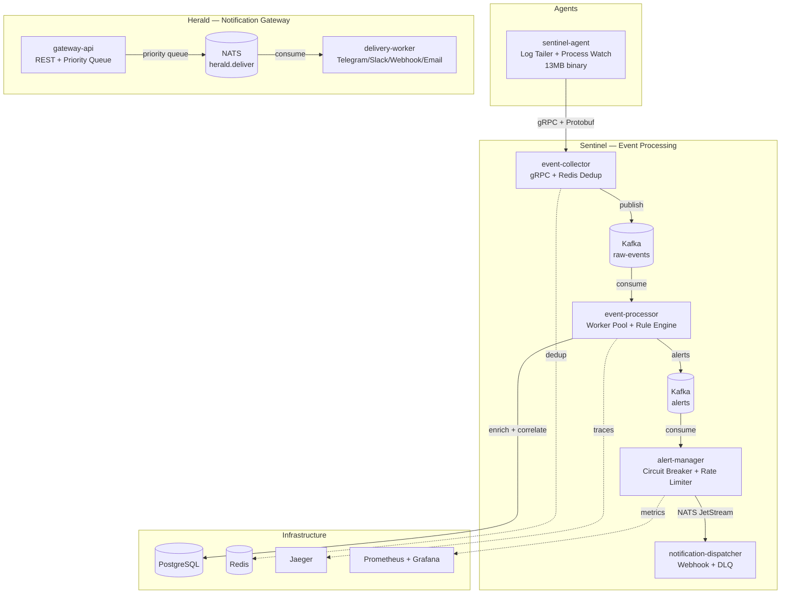

# Sentinel + Herald

[](https://github.com/AudreyRodrygo/Sentinel/actions/workflows/ci.yml)
[](https://goreportcard.com/report/github.com/AudreyRodrygo/Sentinel)
[](https://opensource.org/licenses/MIT)

> Real-time security event processing platform with intelligent notification delivery.

**Sentinel** is a cloud-native SIEM platform that processes 10k+ security events/sec in real time. It collects events from lightweight agents, enriches them with GeoIP and threat intelligence, correlates using a custom rule engine with temporal pattern detection, and delivers alerts in under 100ms.

**Herald** is a smart notification gateway with priority-based delivery (heap queue with SLA enforcement), multi-channel delivery (Telegram, Slack, Webhook, Email), and alert fatigue prevention.

## Architecture



## Key Features

### Sentinel — Security Event Processing
- **Sub-100ms latency** from event ingestion to alert
- **Correlation Rule Engine** with 3 rule types:
  - Single-event rules (field matching, regex)
  - Temporal threshold (sliding window: "5 failures from same IP in 60s")
  - Sequence detection (kill chain: "brute force → login → escalation")
- **Enrichment pipeline**: GeoIP + threat intelligence lookup
- **Severity classification**: automatic CRITICAL/HIGH/MEDIUM/LOW
- **Forensics Replay API**: re-run historical events with new rules via SSE streaming
- **Hot rule reload**: update YAML rules without restart

### Herald — Notification Gateway
- **Priority Queue** with SLA: CRITICAL <1s, HIGH <10s, NORMAL <60s, LOW best-effort
  - Custom heap implementation (Push: 103ns, Pop: 17ns)
- **5 delivery channels**: Webhook (HMAC-SHA256), Telegram Bot, Slack, Email, Log
- **Alert fatigue prevention**: deduplication, rate limiting, digest mode
- **Delivery analytics**: per-channel success rate, latency tracking

### Shared Libraries (`pkg/`)
- **Circuit Breaker**: custom state machine (7.7M ops/sec, 0 allocs)
- **Token Bucket Rate Limiter**: lock-free (4M ops/sec, 0 allocs)
- **Retry**: exponential backoff + jitter, context-aware
- **Dead Letter Queue**: interface + in-memory implementation

## Performance

| Metric | Value |
|--------|-------|
| Rule Engine (single rule) | 12M evaluations/sec (82 ns/op) |
| Rule Engine (threshold) | 180K evaluations/sec (5.5 µs/op) |
| Circuit Breaker (closed) | 7.7M ops/sec (134 ns/op, 0 allocs) |
| Circuit Breaker (open) | 13M ops/sec (89 ns/op, 0 allocs) |
| Rate Limiter | 4M ops/sec (247 ns/op, 0 allocs) |
| Priority Queue (push+pop) | 57M ops/sec (17 ns/op) |
| Agent binary size | 13 MB |

## Tech Stack

| Component | Technology | Why |
|-----------|-----------|-----|
| Language | Go 1.25+ | Low memory, fast binaries, native concurrency |
| Transport | gRPC + Protobuf | Binary serialization (3-10x smaller than JSON), strict schema |
| Event Bus | Kafka (franz-go) | High-throughput log with retention for forensics replay |
| Alert Bus | NATS JetStream | Low-latency fan-out, simpler ops than Kafka |
| Database | PostgreSQL (pgx) | JSONB for flexible enrichment, partitioned tables |
| Cache | Redis | Deduplication (SET NX), rate limiter state |
| Tracing | OpenTelemetry + Jaeger | End-to-end distributed tracing across all services |
| Metrics | Prometheus + Grafana | Custom dashboards with SLA tracking |
| CI | GitHub Actions | Lint (golangci-lint) + test + build on every push |

## Quick Start

```bash
# Start infrastructure (PostgreSQL, Redis, Kafka, NATS, Jaeger, Prometheus, Grafana)
docker-compose -f docker-compose.infra.yml up -d

# Build all 7 services
make build

# Run tests (60+ unit tests)
make test

# Run benchmarks
make bench

# Run linter
make lint
```

## Project Structure

```
├── pkg/                     Shared Go libraries
│   ├── circuitbreaker/      Circuit Breaker pattern (custom, no libs)
│   ├── ratelimiter/         Token Bucket rate limiter (lock-free)
│   ├── retry/               Exponential backoff + jitter
│   ├── dlq/                 Dead Letter Queue abstraction
│   ├── observability/       Logging (zap) + metrics (Prometheus) + tracing (OTel)
│   ├── health/              Kubernetes liveness/readiness probes
│   ├── config/              Viper config with env override
│   ├── postgres/            pgx pool + goose migrations
│   ├── redisutil/           Redis client factory
│   ├── kafkautil/           Kafka producer/consumer (franz-go)
│   └── natsutil/            NATS JetStream helpers
├── proto/                   Protobuf definitions (buf)
├── gen/                     Generated Go code from proto
├── sentinel/                Security event processing platform
│   ├── cmd/                 5 service entry points
│   ├── internal/
│   │   ├── collector/       gRPC server, Redis dedup, Kafka publish
│   │   ├── processor/       Worker pool, enrichment, severity
│   │   │   ├── enrichment/  GeoIP + threat intelligence pipeline
│   │   │   └── rules/       Correlation rule engine (DSL, temporal, sequence)
│   │   ├── alertmgr/        Dedup, rate limit, circuit breaker, routing
│   │   ├── dispatcher/      Webhook (HMAC), retry, DLQ
│   │   ├── agent/           Log tailer, process watcher, batcher
│   │   └── replay/          Forensics replay API (SSE streaming)
│   ├── migrations/          PostgreSQL schema (goose)
│   └── rules/               Example YAML correlation rules
├── herald/                  Smart notification gateway
│   ├── cmd/                 2 service entry points
│   └── internal/
│       ├── gateway/         REST API (chi), priority queue (heap)
│       ├── delivery/        Worker + channel interface
│       │   └── channels/    Webhook, Telegram, Slack, Log
│       └── analytics/       Delivery stats API
├── loadtest/                k6 performance tests
└── grafana/                 Dashboard JSON exports
```

## Design Decisions

| Decision | Rationale |
|----------|-----------|
| Kafka for events, NATS for alerts | Kafka: high-throughput + retention for replay. NATS: low-latency + simpler ops for lightweight alert delivery |
| Custom circuit breaker, not a library | Demonstrates understanding of the pattern. Zero-allocation, 7.7M ops/sec |
| Protobuf over JSON for agent→collector | 3-10x smaller on wire, strict schema catches errors at compile time |
| Worker pool, not goroutine-per-event | Bounded resource usage, natural backpressure via channel buffer |
| Heap-based priority queue from scratch | Shows algorithm knowledge. container/heap requires interface adapters — our version is cleaner |
| Rule engine with YAML DSL | Security teams can add rules without code changes. Hot reload without restart |

## Services

| Service | Port | Protocol | Description |
|---------|------|----------|-------------|
| sentinel-agent | — | gRPC client | Collects events from host (logs, processes) |
| event-collector | 50051 | gRPC | Receives events, dedup, publish to Kafka |
| event-processor | 8082 | metrics | Enriches events, evaluates rules, persists |
| alert-manager | 8083 | metrics | Dedup + rate limit + route alerts |
| notification-dispatcher | 8084 | metrics | Delivers alerts (Webhook, Log) |
| gateway-api | 8090 | REST | Herald notification API + priority queue |
| delivery-worker | 8092 | metrics | Herald delivery (Telegram, Slack, Webhook) |

## Correlation Rules

Rules are defined in YAML and support hot reload:

```yaml
# Detect SSH brute force attacks
id: brute-force-ssh
name: SSH Brute Force Detection
type: threshold
conditions:
  - field: type
    op: eq
    value: EVENT_TYPE_AUTH_FAILURE
  - field: service
    op: eq
    value: sshd
group_by: [source_ip]
threshold: 5
window: 60s
severity: HIGH
```

```yaml
# Detect kill chain: brute force → login → escalation
id: lateral-movement
name: Lateral Movement Detection
type: sequence
group_by: [source_ip]
window: 10m
severity: CRITICAL
steps:
  - conditions:
      - { field: type, op: eq, value: EVENT_TYPE_AUTH_FAILURE }
    count: 5
  - conditions:
      - { field: type, op: eq, value: EVENT_TYPE_AUTH_SUCCESS }
    count: 1
  - conditions:
      - { field: type, op: eq, value: EVENT_TYPE_PRIVILEGE_ESCALATION }
    count: 1
```

## License

MIT
