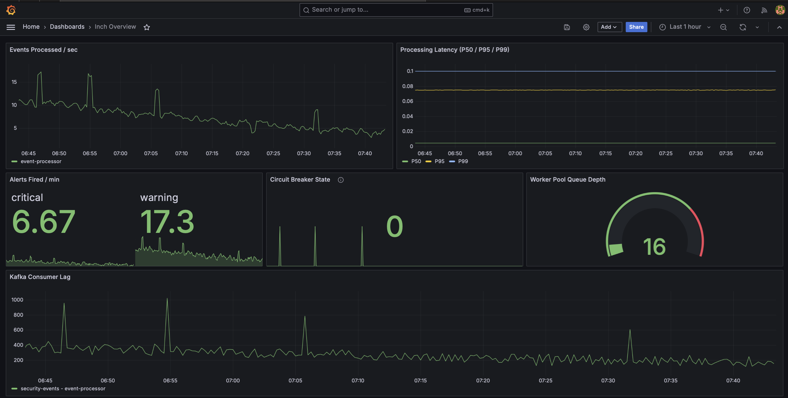

# INCH

[](https://github.com/AudreyRodrygo/INCH/actions/workflows/ci.yml)
[](https://goreportcard.com/report/github.com/AudreyRodrygo/INCH)
[](https://opensource.org/licenses/MIT)

> Real-time security event processing platform. Cloud-native, streaming-first, open-source alternative to ELK and MaxPatrol.

**INCH** is a distributed SIEM platform that ingests security events from lightweight agents, enriches them with GeoIP and threat intelligence, correlates using a custom rule engine with temporal pattern detection, and delivers alerts in under 100ms — all without JVM overhead.

## Architecture

```
  Host (DaemonSet)
 ┌─────────────────┐   gRPC + Protobuf    ┌──────────────────┐  Kafka: raw-events   ┌──────────────────────┐
 │   inch-agent    │ ──────────────────▶  │  event-collector │ ──────────────────▶  │   event-processor    │
 │   13 MB binary  │                      │  Redis dedup     │                      │   Worker pool        │
 └─────────────────┘                      └──────────────────┘                      │   GeoIP enrichment   │
                                                                                    │   Rule engine        │
                                                                                    │   Severity classify  │
                                                                                    └──────────┬───────────┘
                                                                                               │
                                                                                         Kafka: alerts
                                                                                               │
                                                                                               ▼
                                           ┌──────────────────────────────────────────────────────────────┐
                                           │                      alert-manager                           │
                                           │          Deduplication · Rate Limiter · Circuit Breaker      │
                                           └──────────────────────────┬───────────────────────────────────┘
                                                                      │
                                                               NATS JetStream
                                                                      │
                                                                      ▼
                                          ┌──────────────────────────────────────────────────────────────┐
                                          │                 notification-dispatcher                      │
                                          │   Webhook (HMAC) · Slack · Telegram · Email · DLQ + Retry    │
                                          └──────────────────────────────────────────────────────────────┘

  Observability: Prometheus · Grafana · Jaeger (OTLP)       Replay: gateway-api (SSE) ──▶ Kafka offset seek
```

## Key Features

- **Sub-100ms latency** from event ingestion to alert delivery
- **Correlation Rule Engine** with 3 rule types:
  - Single-event rules (field matching, regex)
  - Temporal threshold (sliding window: "5 failures from same IP in 60s")
  - Sequence detection (kill chain: "brute force → login → escalation")
- **Enrichment pipeline**: GeoIP lookup + threat intelligence
- **Severity classification**: automatic CRITICAL / HIGH / MEDIUM / LOW
- **Forensics Replay API**: re-run historical events with new rules via SSE streaming
- **Hot rule reload**: update YAML rules without restart (NATS KV Store)
- **Behavioral baseline**: statistical anomaly detection without ML frameworks
- **Full observability**: Prometheus metrics, Jaeger distributed tracing, Grafana dashboards

## Comparison

| Criterion | ELK Stack | MaxPatrol / KUMA | INCH |
|-----------|-----------|------------------|------|
| Runtime | Java + JVM | Java / C# | Pure Go binary |
| Agent memory | Filebeat: 100–300 MB | 150–500 MB | **13 MB** |
| Event → alert latency | seconds (batch) | 1–5s | **<100ms** |
| Architecture | Monolith + plugins | Closed monolith | Microservices |
| Deployment | Complex | Installer-based | **Kubernetes-first, Helm** |
| License | BSL (non-OSS since 2021) | Commercial | **MIT** |

## Performance

Benchmarks run on Apple M4 (`go test -bench=. -benchmem -count=3`):

| Component | Throughput | Latency | Allocs |
|-----------|-----------|---------|--------|
| Circuit Breaker (closed state) | ~7.2M ops/sec | 138 ns/op ± 4 | 0 |
| Circuit Breaker (open state) | ~11M ops/sec | 91 ns/op ± 2 | 0 |
| Rate Limiter (token bucket) | ~4M ops/sec | 246 ns/op ± 11 | 0 |
| Priority Queue push | ~18M ops/sec | 56 ns/op ± 3 | 0 |
| Priority Queue push+pop | ~8.3M ops/sec | 121 ns/op ± 6 | 0 |
| Agent binary size | — | — | 13 MB |

## Tech Stack

| Component | Technology | Why |
|-----------|-----------|-----|
| Language | Go 1.23 | Low memory, fast binaries, native concurrency |
| Transport | gRPC + Protobuf | Binary serialization (3–10x smaller than JSON), strict schema |
| Event Bus | Kafka (franz-go) | High-throughput log with retention for forensics replay |
| Alert Bus | NATS JetStream | Low-latency fan-out, simpler ops than Kafka for alert delivery |
| Database | PostgreSQL (pgx) | JSONB for flexible enrichment, native driver (no ORM) |
| Cache | Redis | Deduplication (SET NX + TTL), rate limiter state, baseline windows |
| Tracing | OpenTelemetry + Jaeger | End-to-end trace ID propagated across gRPC → Kafka → NATS |
| Metrics | Prometheus + Grafana | Custom dashboards, SLA tracking, worker pool saturation |
| CI | GitHub Actions | Lint → test (-race) → build on every push |

## Observability



_Events processed/sec · Processing latency P50/P95/P99 · Alerts fired/min · Circuit breaker state · Kafka consumer lag_

## Quick Start

```bash
# Start infrastructure (PostgreSQL, Redis, Kafka, NATS, Jaeger, Prometheus, Grafana)
docker-compose -f docker-compose.infra.yml up -d

# Regenerate protobuf bindings (requires buf: https://buf.build/docs/installation)
make proto-gen

# Build all 5 services
make build

# Run unit tests
make test

# Run benchmarks
make bench

# Run linter
make lint
```

## Project Structure

```
├── pkg/                     Shared Go libraries (importable independently)
│   ├── circuitbreaker/      Circuit Breaker — custom state machine, zero-allocation
│   ├── ratelimiter/         Token Bucket rate limiter — lock-free
│   ├── retry/               Exponential backoff + jitter, context-aware
│   ├── dlq/                 Dead Letter Queue abstraction
│   ├── observability/       Logging (zap) + metrics (Prometheus) + tracing (OTel)
│   ├── health/              Kubernetes liveness/readiness probes
│   ├── config/              Viper config with env override
│   ├── postgres/            pgx pool + goose migrations
│   ├── redisutil/           Redis client factory
│   ├── kafkautil/           Kafka producer/consumer (franz-go)
│   └── natsutil/            NATS JetStream helpers
├── proto/                   Protobuf definitions (buf)
├── gen/                     Generated Go code from proto
├── inch/                    Security event processing platform
│   ├── cmd/                 5 service entry points
│   └── internal/
│       ├── collector/       gRPC server, Redis dedup, Kafka publish
│       ├── processor/       Worker pool, enrichment, severity classification
│       │   ├── enrichment/  GeoIP + threat intelligence pipeline
│       │   └── rules/       Correlation rule engine (single, temporal, sequence)
│       ├── alertmgr/        Dedup, rate limit, circuit breaker, routing
│       ├── dispatcher/      Webhook delivery, retry, DLQ
│       ├── agent/           Log tailer, process watcher, batcher, backpressure
│       └── replay/          Forensics replay API (SSE streaming)
│   ├── migrations/          PostgreSQL schema (goose)
│   └── rules/               Example YAML correlation rules
├── loadtest/                k6 performance tests
└── grafana/                 Dashboard JSON exports
```

## Services

| Service | Port | Protocol | Description |
|---------|------|----------|-------------|
| inch-agent | — | gRPC client | Collects events from host (logs, processes, network) |
| event-collector | 50051 | gRPC | Receives events, dedup via Redis, publish to Kafka |
| event-processor | 8082 | HTTP metrics | Enriches events, evaluates correlation rules, persists |
| alert-manager | 8083 | HTTP metrics | Dedup + rate limit + circuit breaker + route alerts |
| notification-dispatcher | 8084 | HTTP metrics | Delivers alerts via Webhook with retry and DLQ |

## Correlation Rules

Rules are defined in YAML and support hot reload without restart:

```yaml
# Detect SSH brute force attacks
id: brute-force-ssh
name: SSH Brute Force Detection
type: threshold
conditions:
  - field: type
    op: eq
    value: EVENT_TYPE_AUTH_FAILURE
  - field: service
    op: eq
    value: sshd
group_by: [source_ip]
threshold: 5
window: 60s
severity: HIGH
```

```yaml
# Detect kill chain: brute force → successful login → privilege escalation
id: lateral-movement
name: Lateral Movement Detection
type: sequence
group_by: [source_ip]
window: 10m
severity: CRITICAL
steps:
  - conditions:
      - { field: type, op: eq, value: EVENT_TYPE_AUTH_FAILURE }
    count: 5
  - conditions:
      - { field: type, op: eq, value: EVENT_TYPE_AUTH_SUCCESS }
    count: 1
  - conditions:
      - { field: type, op: eq, value: EVENT_TYPE_PRIVILEGE_ESCALATION }
    count: 1
```

## Design Decisions

See [ARCHITECTURE.md](ARCHITECTURE.md) for full rationale.

| Decision | Rationale |
|----------|-----------|
| Kafka for events, NATS for alerts | Kafka: high-throughput + retention for forensics replay. NATS: low-latency + simpler ops for alert fan-out |
| Custom circuit breaker, not a library | Zero-allocation, 7.2M ops/sec. Shows pattern understanding, not just library usage |
| Protobuf over JSON for agent→collector | 3–10x smaller on wire, schema validated at compile time |
| Worker pool with bounded channel | Natural backpressure — Kafka consumer pauses when workers are saturated |
| Rule engine with YAML DSL | Security teams update rules without code changes. Hot reload via NATS KV |

## License

MIT
